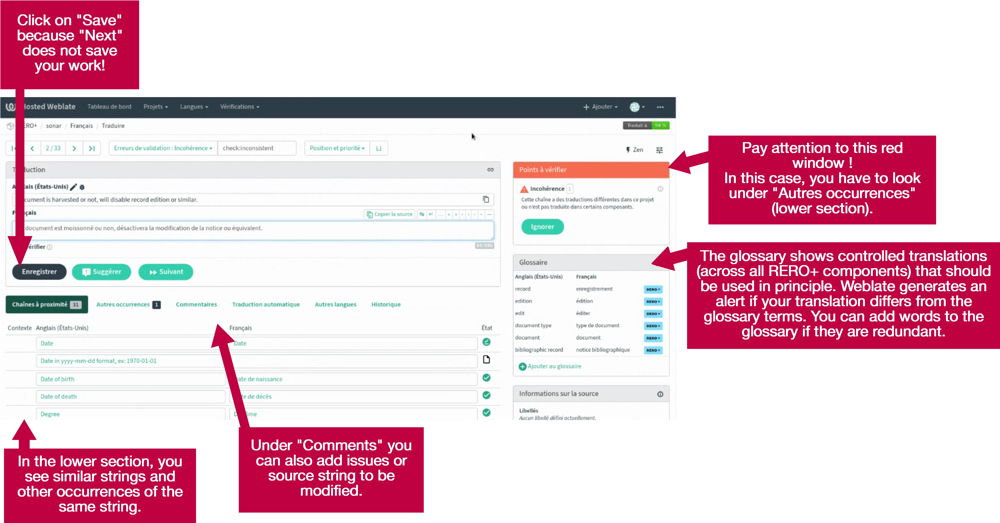

# Translations workflow

## Table of content

1. [Introduction][6]
1. [The *very* first time][7]
1. [The regular workflow][3]
1. [Some weblate settings][5]
1. [Tips for the translators][8] 

## Introduction

We're using weblate as a web service to help the translation process, through
the hosted service of weblate: https://hosted.weblate.org/projects/rero_plus

For our needs, on weblate, we have one project (named RERO +, with `rero_plus`
as slug), with many *components*:

- `ng-core`.
- `rero-ils`.
- `rero-ils-public-search` (from the GitHub `rero-ils-ui`).
- `rero-ils-admin` (from the GitHub `rero-ils-ui`).
- `sonar`.
- `sonar-ui`.

## The *very* first time

When every existing PR that contains modifications on the translated files are
merged into the `dev` branch of the corresponding GitHub project:

1. Verify that on the GitHub repository settings, the webhook is active.
1. Go through [the regular workflow][3] (below), to extract messages, update
   catalogs and to update weblate component through GitHub repository.
1. Verify that the weblate component is up to date with the GitHub project. To
   do that you can either:
    - Got to https://hosted.weblate.org/projects/rero_plus/ng-core/#repository
      (change `ng-core` to your needs) and check the repository status.
    - Or clone the weblate `git` repository and inspect the `git` logs (`git
      clone 'https://hosted.weblate.org/git/rero_plus/<component>/')`.
3. Unlock the translations (you can do that on the web interface, or through
   the [`wlc` client][4]).
4. Inform the translators that weblate is ready.

## The regular workflow

For the synchronisation workflow, it's semi automatic:

- A GitHub application is installed in the RERO GitHub organization.
- In each repository, a web hook is configured, as [explained in the weblate
  documentation][1].

This ensures two things:

1. As changes are merged into the `dev` branch of our repository, the weblate
   service is informed through the webhook and pulls changes to the weblate
   `git` repository. It's done with a `git rebase` command, as it can be
   configured in the component settings [component/settings/version control].
1. As translations are being made through the weblate interface, commits are
   being made. 24 hours after a commit ([see settings section][5]), a PR is
   created on the corresponding GitHub repository (called *upstream* by the
   weblate documentation).

As it is managed with `git`, and as we use *bilingual* files (each translation
files has two languages), which supposes to update the catalogs, conflicts can
happen. To avoid such conflicts, [the documentation][2] proposes something like
the following:

*You'll need to [install and configure the `wlc` client][4]*.

1. The `dev` branch (*upstream*) is moving. Developers do not
   `extract_messages` nor `update_catalog`.
1. From time to time, the person responsible for the translations updates
   weblate:
    1. Ensure weblate is in a clean state: all changes are commited (`wlc
       commit rero_plus/<component>`).
    1. Block the translations on the component (`wlc lock
       rero_plus/<component>`).
    1. Push weblate on `rero:dev` (`wlc push rero_plus/<component>`).
    1. Pull the weblate commit locally (`git pull`).
    1. Extract the messages and update the catalogs. Commit the changes.
    1. Push *upstream* (`git push`).
    1. Verify that weblate is being automatically updated.
    1. Unlock translations on weblate (`wlc unlock rero_plus/<component>`).
1. Translators can work on weblate.
1. Weblate creates PR on the `dev` branch of the GitHub repository. 
1. Weblate PR are being merged into `dev`.

The section 2 could be scripted, once it's validated.

## Some weblate settings

- [component/settings/version control] Merge Style: rebase.
- [component/settings/version control] Age of changes to commit: 24 [hour].
- [rero_/#workflow] Source language: English (United States). This sets `en_US`
  as the source language file, in order to avoid translating it.
- [component/settings/files]: filter: `^(?!(en_US)$).+$` (for `ng-core`,
  `public-search`, `admin`). This is needed, as in our angular project, the
  source language file is the same as a translated language files.
- [component/settings/files]: filter: `^(?!(messages)$).+$` (for `sonar-ui`).
  The same as the precedent setting, but adapted to the `sonar-ui`
  configuration.
- on each component, [addons]:
    - automatic translations, suggest strings for non translated strings, use
      machine translations (deepl, weblate, weblate translation memory), with
      80 thresold.
    - squash git commits, per language, add contributors in the commit message,
      copy paste the regular commit message.
    - only for JSON based component, customize JSON output, with 2 space for
      indentation.

## Tips for the translators

- Have a look, even shortly to the [weblate documentation][9]:
    - Especially on [*Translating using Weblate*][10].
- In each component, a language is the source code. It is in a darker green and
  has a specific icon: this language should not be translated, of course.
- On the language overview of each component, there are some links to strings grouped by
  status: translated, to be reviewed, needing actions, and so on. This is
  actually useful.
- In the same spirit, once a string is selected,
    - on the right of the editor, you may have some information: on top a
      glossary, if any, and on the bottom links to the source code, if it can
      help to understand the context.
    - below the left section, there are some tabs:
        - nearby strings, which sometimes can help have a context,
        - other occurences, which helps to be coherent,
        - comment,
        - machinery, which can provide automatic suggestions,
        - other languages, to check how this string is translated in other
          languages,
        - history.

[1]: https://docs.weblate.org/en/latest/admin/continuous.html#automatically-receiving-changes-from-github
[2]: https://docs.weblate.org/en/latest/admin/continuous.html#avoiding-merge-conflicts
[3]: #the-regular-workflow
[4]: https://docs.weblate.org/en/latest/wlc.html
[5]: #some-weblate-settings
[6]: #introduction
[7]: #the-very-first-time
[8]: #tips-for-the-translators
[9]: https://docs.weblate.org
[10]: https://docs.weblate.org/en/latest/user/translating.html
